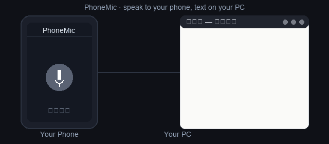
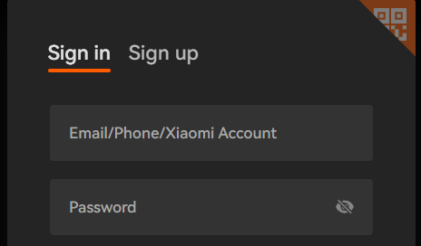
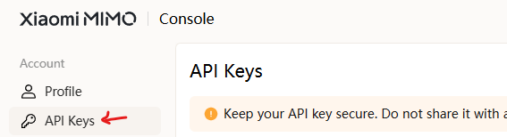
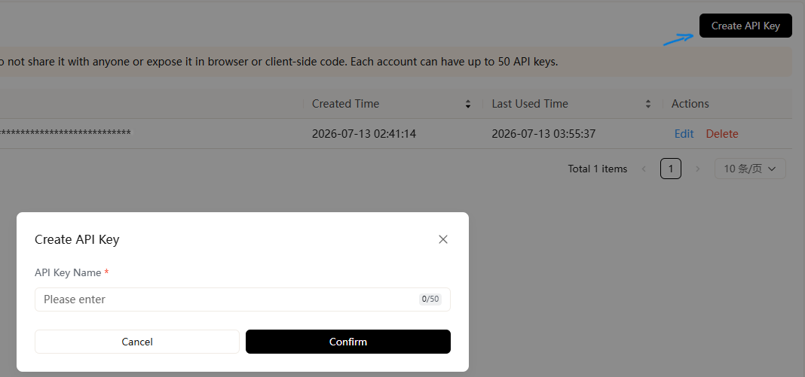

<p align="center">
  <a href="README.en.md">📖 English</a>
</p>

<p align="center">
  
</p>

<h1 align="center">TypMic</h1>

<p align="center"><b>把手机变成电脑的无线麦克风——开口说话，文字就落在光标处，像用嘴在电脑上打字。</b></p>

<p align="center">手机浏览器扫码即连，语音走纯局域网、<b>音频不出内网</b>。云端 MiMo + 本地 Whisper <b>双引擎识别</b>，配合术语表纠错与可选 AI 润色，让口述直接变成能用的文本。Windows / macOS / Linux 通用。</p>

<p align="center">
  <a href="LICENSE"></a>
  
  
  
  
</p>

## 目录

- [工作原理](#工作原理)
- [快速开始](#快速开始)
  - [项目下载](#项目下载)
  - [Windows](#windows)
  - [macOS](#macos)
  - [手机连接](CONNECT_PHONE.md)

## 与同类工具对比

| 维度    | TypMic（本项目）                                       | 多数同类方案                       |
| ----- | --------------------------------------------------- | ---------------------------- |
| 手机端   | 手机浏览器录音，扫码即用，无需安装 App                               | 需装 App，或依赖特定手机输入法            |
| 识别能力  | 小米 MiMo 云端（中文 / 方言 / 中英混说）+ 本地 faster-whisper 离线双模式 | 多为单一引擎 / 单方案                 |
| 文本后处理 | 可选 AI 润色（自动加标点 / 命令词分段 / 去口头禅 / 顺句 / 数字规范）+ 术语表错词纠正，均本地可配 | 多数无，或绑定订阅服务的云端整理 |
| 控制按键  | 内置 回车 / 换行 / 删除 / 清空 四键，标准按键事件，跨平台                  | 多依赖 Windows 专属 AutoHotkey 脚本 |
| 跨平台   | Windows / macOS / Linux 通用，无平台绑定                    | 常限定 Windows                  |
| 网络与隐私 | 纯局域网，数据不出内网；离线模式音频完全不出本机                            | 常经公网 / 第三方中转                 |

## 工作原理

```
手机浏览器                  电脑（运行本服务）
    |                           |
    |---- 录音(HTTPS POST) ---->|  /api/transcribe
    |                           |      ↓ ffmpeg 转 16k 单声道 wav
    |                           |      ↓ 调用 MiMo-V2.5-ASR 云端 API   （云端模式）
    |                           |      ↓ faster-whisper 本地模型        （离线模式）
    |                           |      ↓ 术语表纠正（glossary.txt，可选）
    |                           |      ↓ AI 润色整理（去口头禅/分段/数字规范，可选）
    |<--- 返回识别文本 ---------|      ↓ 复制到剪贴板 + Ctrl+V 粘贴到光标
```

<p align="center">
  
</p>

## 环境要求

- Python 3.10+
- [ffmpeg](https://ffmpeg.org)（需加入系统 PATH）
- 一台电脑 + 同一 WiFi 下的手机

## 快速开始

### 项目下载

1. 打开 GitHub 仓库的 **Releases** 页面。
2. 下载最新版本的压缩包（如 `Source code (zip)`）。
3. 把压缩包解压到任意目录。
4. 进入解压后的 **`TypMic`** 文件夹。

### Windows

1. 申请小米 MiMo API key（<https://platform.xiaomimimo.com>，仅云端模式需要）
2. **首次使用先放行防火墙**：右键 `allow_firewall.bat` →「以管理员身份运行」
3. 双击 `start.bat`
4. 按手机系统完成连接（见 [手机连接详解](CONNECT_PHONE.md)）
5. 电脑上把光标放到要输入的位置，手机说话即可自动输入

### macOS

1. **装 ffmpeg**（转码用，pip 装不了）：`brew install ffmpeg`（没有 Homebrew 先去 [brew.sh](https://brew.sh) 装）。
2. **开权限**（系统设置 → 隐私与安全性）：防火墙放行 **Python**、辅助功能里给 **终端** 打勾（否则手机连不上或打不出字）。
3. **进项目目录跑起来**：

```bash
python3 -m venv .venv && source .venv/bin/activate
pip install -r requirements.txt
export MIMO_API_KEY=你的key    # 或在项目根目录建 .env 写 MIMO_API_KEY=你的key
python voice_input_server.py
```

**离线模式**（无需 API key、语音不出本机）：把上面的 `export MIMO_API_KEY` 那行去掉，末尾改跑下面三行——首次启动会自动下载识别模型（默认 `small`）：

```bash
pip install faster-whisper
export TYPOMIC_ASR=local
python voice_input_server.py
```

启动后屏幕显示「手机访问地址」和二维码，按 [手机连接详解](CONNECT_PHONE.md) 操作。

## 获取免费的小米 MiMo API Key

云端模式需要一个免费的小米 MiMo API Key，3 步即可拿到：

<details>

<summary>📌 点击展开：3 步图文获取免费 MiMo API Key</summary>

**1. 注册 / 登录** <https://platform.xiaomimimo.com>（小米账号）



**2. 进控制台 → 左侧「API 密钥」**



**3. 创建密钥 → 立刻复制**（只显示一次），填进 `.env`：`MIMO_API_KEY=你的key`



</details>

> ⚠️ **费用提醒（开 AI 润色前先看）**
> 在小米 MiMo 开放平台（platform.xiaomimimo.com）注册即送 **¥10 API 体验金（40 天有效）**，日常口述每天 30 分钟左右，体验金阶段够用**一个多月**。用完后可按量充值（需实名认证）。想**完全零费用**，关掉 AI 润色 + 用离线模式即可——离线识别在本机运行，不调用任何小米接口。

## AI 润色与术语表（可选增强）

TypMic 默认开启两项后处理：**自动补标点** + **把听错的专业词纠正成正确写法**，让口述结果直接能用。这两项都在 `start.bat` 启动菜单里一键开 / 关，**默认已开，无需改任何配置**。

> 开启 AI 润色时，识别文本会发往你的 MiMo 接口整理；要完全不出网，在菜单里关掉它即可（音频始终只走局域网）。

## 常见问题

<details>

<summary>❓ 延迟大概多少毫秒？</summary>

**云端模式**下，一段普通语句（一两句话）端到端约 **1–2 秒**——手机采集 + 局域网上传 + MiMo 识别 + 粘贴。 **离线模式**取决于模型大小与硬件：CPU 上 `small` 模型通常每段几百毫秒到约 1–2 秒；用 GPU 或 `tiny`/`base` 模型会更快。

</details>

<details>

<summary>❓ 支持多长的语音？</summary>

没有硬性上限，但每次「按住说话」是一段录音。为兼顾识别准确率与延迟，建议单段控制在**几十秒到两三分钟**；长文稿拆成多段短录音效果更好，文字会持续流入光标。

</details>

<details>

<summary>❓ 断网能用吗？</summary>

**云端模式**需要联网（调用 MiMo 的 ASR 接口），但你的**音频只会经自己的局域网传到本机电脑**，不经过任何第三方中转。若要做到**完全不联网**，请开启**离线模式**（`TYPOMIC_ASR=local`）：识别全程在本机运行，彻底离线可用。

</details>

<details>

<summary>❓ 我的语音隐私有保障吗？</summary>

云端模式下，音频只会离开局域网去访问小米 ASR 接口做转写，TypMic 不存储任何内容；离线模式下音频则完全不出本机。

</details>

<details>

<summary>❓ 手机连不上 / 提示「已拒绝连接」？</summary>

启动时会打印详细诊断信息（IP / ffmpeg / 证书 / 端口 / key 状态），连接问题看这里即可；电脑端 `https://localhost:8443/desktop` 还有实时连接状态页。多数「已拒绝连接」是防火墙拦截了 8443 端口（见快速开始）。

</details>

## 许可证

[MIT](LICENSE) © TypMic 贡献者。

## 贡献与支持

- 想参与开发？请看 [CONTRIBUTING.md](CONTRIBUTING.md)。
- 发现安全漏洞？请遵循 [SECURITY.md](SECURITY.md)。
- 需要帮助？查看 [SUPPORT.md](SUPPORT.md)。
